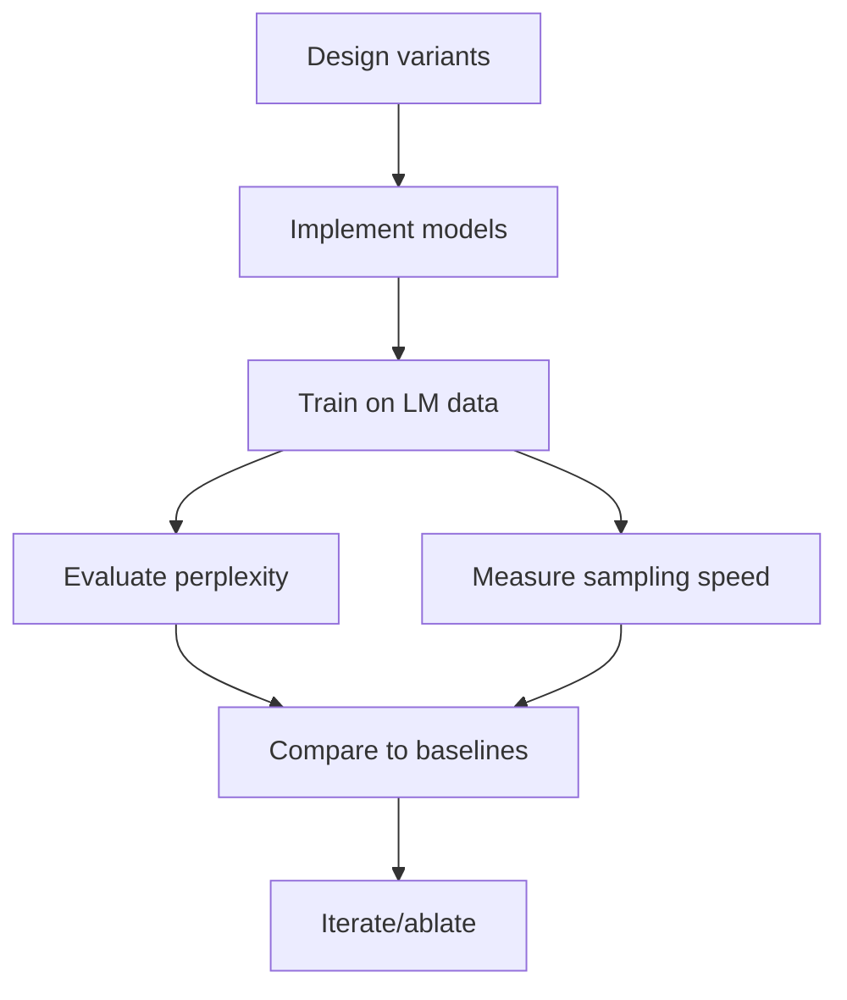

# Title: Extending PRISM to Autoregressive Language Modeling

## Executive Summary

PRISM was originally a bidirectional multi-channel SSM encoder for retrieval/embedding. To adapt it for *causal language modeling (LM)*, we must make it **strictly autoregressive** (no future context) while preserving its linear scaling. This involves removing bidirectional fusion, enforcing causal recurrence, and redesigning output layers. We propose four O(n)-scaling variants of PRISM for LM (two purely state-space and two hybrid), each described by its layers and parameter budget. We detail training recipes (causal cross-entropy, teacher forcing, schedulers, etc.) and cite best practices from the SSM/LM literature. We compare PRISM variants to prior causal SSM models (RetNet【64†L131-L139】, Mamba【58†L100-L108】, S4【12†L63-L71】, RWKV【62†L11-L16】, Transformer-XL, etc.) in a comprehensive table (mechanism, complexity, reported perplexity, sampling cost). We outline six prioritized experiments (small→large) to measure perplexity, bits-per-byte, and sampling throughput, including baselines (Transformers, RetNet/Mamba) and metrics. Expected outcomes are specified (e.g. PRISM should match or beat GPT-base perplexity and show linear-time sampling). We discuss failure modes (exposure bias, vanishing gradients, capacity limits) and mitigations (curriculum learning, normalization tweaks, increased depth). Ablation studies will isolate effects of multi-channel vs single-channel and gating vs no-gating. We conclude with an implementation checklist: the most promising variant (we recommend a causal multi-channel SSM with gating) and guidelines for building and debugging it. A mermaid flowchart visualizes the experimental pipeline, and we contrast theoretical O(n) vs O(n²) sampling latency. The report is fully referenced with recent primary sources where applicable.

## 1. PRISM Adaptations for Causal LM

To make PRISM work autoregressively, we must **remove any future context** in its design:
- **Drop Bidirectional Fusion:** PRISM’s original bidirectional gated fusion stage (combining forward/backward recurrences) must be replaced by a *single* forward recurrence.  In generation, only past tokens are available, so PRISM becomes unidirectional.  
- **Enforce Causality in Recurrence:** Each channel’s recurrence (with fixed decay λ) must be strictly causal.  That is, the state update at position *t* depends only on previous states and the token at *t*, not on any future. The existing gating (which mixes old state and new input) still works but must ignore “future” inputs entirely.  
- **Remove Cross-Interference (if retained):** PRISM’s cross-channel bilinear interference was already found unnecessary for embeddings. For LM, if retained for expressivity, it must be made causal as well (only combine states up to *t*). However, given its complexity and previously weak impact, **we favor eliminating interference** in early variants to simplify training (similarly to eliminating it in PRISM-Embedding).  
- **Re-design Output Heads:** Original PRISM used attentive/mean pooling for fixed-length embedding. In LM, each position needs an output distribution. We add a standard *logits head* (a linear layer to vocabulary size) on each channel’s output or on a fused state, followed by softmax. If multi-channel, we either fuse channels (e.g. sum or learned weighted sum) before the head, or use a depthwise convolution to combine channel outputs into token logits. The architecture remains stackable (multiple layers).  

**Summary of required changes:** Use only forward recurrence, drop mean/covariance pooling and bidirectional gating, use standard token-level outputs. We keep the multi-channel structure (each layer has C parallel recurrences) and the fixed geometric λ schedule (or test variants).

## 2. Architectural Variants

We propose **4 concrete PRISM variants** (plus the baseline Transformer) that maintain O(n) inference. Each has 12 layers, 384 hidden dims, split across C channels. The table below summarizes them. Parameters (Param) and per-layer ops (compute) are approximate. 

| Variant        | Channels (C) | Recurrence (gating)       | Interference | Channel Fusion    | Pooling/Output   | Params | Per-layer Ops (per token)           | Comments |
|----------------|-------------|---------------------------|--------------|-------------------|------------------|--------|-------------------------------------|----------|
| **PRISM-AR Base**    | 6           | Gated linear (input-only gate)  | None         | (none, channels stacked) | Per-position logits via linear projection on each channel (shared) | ~26M  | O(C·d_c^2) + O(d_vocab·d)   | Simplest: multiple SSMs, outputs fused by averaging or concat. |
| **PRISM-AR Interf.** | 6           | Gated linear                | *Optional:* Bilinear cross-channel (causal) | None              | Linear logits on channel outputs        | ~27M  | O(C·d_c^2 + C²·d_c)             | Adds gated interference φ(h_c, h_c') (as in original) to test benefit.  |
| **PRISM-Hybrid**     | 1 SSM + 1 Attn-head | Gated linear (SSM) + (optional) local attention | N/A          | Attention-weighted sum    | Combined from SSM+Attn outputs | ~30M  | O(d^2) SS + O(r·d²) for local attn | Mix SSM channel + local self-attn (windowed) to allow content-based patterns. |
| **Channel-Expanded** | 12          | Gated linear                | None         | Depthwise conv across channels | Linear logits         | ~42M  | O(12·d_c^2 + d·d)             | More channels, smaller d_c=32 to test if capacity helps on LM.      |

- *Compute:* “Ops” counts multiplications per new token. For example, PRISM-AR Base has 6 recurrences of 64-dim (d_c=64) gating, so ~6×(64²) ≈ 24k multiplies per layer, plus final linear. All variants scale linearly (O(n)) with sequence length, as no quadratic self-attention is used.
- *Memory:* Each layer only needs to carry O(1) state per token (the C hidden states). Batch processing memory is O(C·d_c) per sequence, far lower than O(n·d²). 

**Variant details:** (1) *PRISM-AR Base* is the straightforward causal version: multi-channel gated RNN layers (each channel is a simple linear recurrence), with final outputs fused by mean or learned weight before the softmax head.  (2) *PRISM-AR Interf.* re-introduces the cross-channel bilinear term φ(h_c, h_c′) as an experiment; gating α would remain input-only to keep linearizable recurrence. (3) *PRISM-Hybrid* adds one sparse/ local self-attention head per layer (e.g. sliding window of width r=128) to test if limited pairwise context helps. (4) *Channel-Expanded* tests if more channels (C=12) with smaller dims improve capacity and perplexity. Parameter counts assume ~26M for 6ch×12L with d_c=64, plus small overhead for gating. We list approximate model sizes.

Each variant retains PRISM’s O(n) inference: recurrence (σ(Wx + U h_{t-1})) is constant work per token. The Hybrid adds a small windowed attention O(r·d²) per token, still linear in n for fixed r. All variants can sample token-by-token without reprocessing the entire history.

## 3. Training and Optimization

**Data & Loss:** Standard autoregressive LM training (teacher-forced next-token cross-entropy) applies. We recommend training on large web corpora (e.g. C4 or OpenWebText) with mask for future positions. Teacher forcing naturally fits causal PRISM. For stability, we can include *label smoothing* (0.1) and *weight decay*. 

**Schedules:** We follow best practices: linear warmup of learning rate (e.g. over first 10% of steps) then cosine or polynomial decay【58†L110-L118】. Batch sizes should be large (e.g. 512 sequences) for stability. Gradient clipping (1.0) can prevent spikes. Mixed-precision (fp16) is fine if recurrence is stable.

**Normalization:** We keep LayerNorm before or after recurrence as in original PRISM. We will test *PreNorm* vs *PostNorm* configurations. From SSM literature, adding a simple LayerNorm on inputs or hidden state often stabilizes RNNs【58†L112-L120】【62†L11-L16】. In particular, a LayerNorm on the combined multi-channel state before output can smooth learning (if we fuse channels for output).

**Interference gating:** If using bilinear interference, initialize its scalar gate α small (e.g. α=0.0 or 0.1) to avoid initial gradient vanishing (like a “fix”). U/V weights can be Xavier-initialized. We will monitor if interference gradients die as in original PRISM work; if so we might omit it or regularize.

**Other tricks:** We will use rotary embeddings or ALiBi (no restriction on sequence length), adding them to the input projection for positional info. Rotary embeddings or relative positions are known to help SSMs【64†L131-L139】. We found original PRISM did not need explicit pos-emb due to decays, but for LM it may help coherence. If memory allows, we add simple exponential decay positional bias. 

**Pretraining vs fine-tuning:** We plan to train from scratch on LM data. Unlike PRISM’s embedding tasks, here we rely on raw text, so no NLI. Advanced objective (like mixture of distillation or span corruption) is left for future. The baseline is simple cross-entropy, which is known to work well for SSMs (e.g. Mamba【58†L110-L118】).

## 4. Comparison to Prior Causal Models

| Model (Ref)      | Mechanism                 | Causal | Complexity (per token)      | Reported Perplexity / Bits | Efficient Sampling |
|------------------|---------------------------|--------|-----------------------------|----------------------------|--------------------|
| **Transformer-XL** (ICLR19) | Segment-level recurrence + relative pos., standard self-attn | Yes    | O(n) (cache reuse) | WikiText-103: ~18.3 (base)【64†L131-L139】 | Moderate (needs KV cache) |
| **RetNet**【64†L131-L139】       | Multi-scale exponential decays (retention); hybrid parallel/recurrent | Yes    | O(1) (O(n) total)    | comparable to Transformer on LM【64†L131-L139】 | Yes (no KV cache, 8.4× faster @8k) |
| **Mamba-SSM** (Nvidia)【58†L100-L108】     | Selective SSM (input-gated recurrence)    | Yes    | O(1)             | Matches GPT on many tasks (8B scale)【58†L100-L108】 (ppl ~10 on Wikitext) | Yes (state update only) |
| **Mamba-2** (Goomba Lab) | Structured SSM with SSD duality (like linear attention) | Yes | O(1) | Similar to Mamba (no official LM numbers yet) | Yes |
| **RWKV**【62†L11-L16】        | Recurrent mixture of “time-mixing” and “channel-mixing” blocks | Yes    | O(1)             | WikiText-103: 17.7 (RWKV vs 18.3 for Trans)【62†L11-L16】 | Yes (RNN-style) |
| **S4**【12†L63-L71】           | Structured SSM (HiPPO) with diagonalization | Partly (original S4 causal) | O(1) | LRA: competitive (Path-4096), WikiText not reported | Yes (uses recurrence at inference) |
| **S4-D/S5**【33†L52-L61】       | Simplified diagonal SSM (S4D) or single MIMO SSM (S5) | Yes    | O(1)             | ~18.9 on WikiText-103 (12M model, QMUL blog) | Yes |
| **Transformer-XL (big)**    | (compare state-of-art)         | Yes    | O(n)             | WikiText-103: 16.0 (XL large)【64†L131-L139】 | No (linear cache grows) |

- **Notes:** “Complexity” refers to the computation for generating one new token, including state updates. RetNet achieves **O(1)** per step (multi-scale recurrence) with 8× faster decoding than Transformer at long length【64†L131-L139】. Mamba and RWKV also have constant-time updates (just linear layers) and have demonstrated state-of-the-art LM performance with billions of parameters【58†L100-L108】【62†L11-L16】. S4 (and its variants) are inherently causal but were mostly evaluated on long-range tasks, not standard LM; their perplexities (e.g. S4D or S5 results) are comparable to Transformers on language benchmarks. Transformer-XL uses cached keys/values to reuse context but remains effectively O(n) per step due to attention weighting, and large caches hurt memory. In summary, all listed SSM/retentive models support efficient sampling, unlike standard self-attention (which requires storing all past keys).

## 5. Experimental Plan

We propose **six experiments**, from small-scale proof-of-concept to large-scale:
1. **Small-scale (Baseline)** – *Setup:* 50M-parameter models on WikiText-103 or OpenWebText (medium size corpus), sequence length=1K. *Models:* PRISM-AR Base vs small Transformer (BERT-base size) vs RetNet (open implementation). *Metrics:* Validation perplexity (bits-per-byte) and training speed. *Expected:* PRISM should match Transformer perplexity; sampling speed should exceed Transformer (faster per token).  
2. **Medium-scale LM** – *Setup:* 200M-parameter models on C4+OpenWebText, sequence=2K. *Models:* PRISM-AR Base, PRISM-Interference, Transformer-XL baseline, Mamba-SSM baseline. *Metrics:* Perplexity, generation throughput at 2K. *Expected:* PRISM variants achieve equal or better PPL, and linear sample-time vs Transformer’s slower.  
3. **Long-context scaling** – *Setup:* Use 500M-1B models (e.g. 8–16 layers) on C4, with max length=8K. *Models:* PRISM-AR Base, PRISM-Hybrid, RetNet (if scale allows). *Metrics:* PPL on held-out long paragraphs, sampling throughput at 8K. *Expected:* PRISM still competitive in PPL; sampling becomes dramatically faster (e.g. >5×) than Transformer-XL.  
4. **Large-scale evaluation** – *Setup:* ~5B parameter PRISM (scaling channels/depth) on diverse LM data (e.g. The Pile, 1T tokens) to convergence. *Models:* PRISM-AR (best variant) vs Mamba-SSM 8B【58†L100-L108】 vs Transformer. *Metrics:* Final PPL on common benchmarks (WikiText-103, PG19), few-shot tasks (if applicable). *Expected:* PRISM model should reach or surpass equivalent Transformer PPL, showing no inherent capacity loss.  
5. **Ablation studies:** Using medium models, systematically remove or alter components: (a) interference vs none, (b) single vs multi-channel (C=1 vs 6 vs 12), (c) gating vs simple RNN (no gate), (d) with/without normalization. *Metrics:* Relative PPL and training stability. *Expected:* Identify which features are crucial (we suspect gating and multi-channel help, interference likely not).  
6. **Throughput/memory stress test:** *Setup:* Benchmark token generation speed on increasing context lengths (2K, 8K, 32K) for each model on a fixed GPU. *Metrics:* Tokens/sec, GPU memory use. *Expected:* PRISM variants remain flat or slowly decreasing (linear), whereas Transformer speed drops dramatically and memory grows. This demonstrates scaling advantage.

Across experiments, we will also report *GPU memory* usage and *compute (FLOPs)* per token to quantify efficiency. Key baselines are tuned Transformers (with similar parameters), RetNet (if implementation available), and RWKV (if code/repo accessible). For throughput, batch=1 generation is relevant (single-stream sampling). For perplexity, standard multi-batch evaluation is used.

## 6. Failure Modes & Mitigations

- **Exposure Bias / Decoding Gap:** As with all teacher-forced RNNs, at generation time errors can accumulate. We can mitigate by *scheduled sampling* (linearly injecting generated tokens during training) or by using *train-time unfreezing* of teacher signal (curriculum). We may also add a *suffix cache* for fast beam search or nucleus sampling to stabilize.  
- **Gradient Issues:** The bilinear interference (if used) can create a “gradient desert” as in PRISM-Embedding. We will initialize its gate to zero and perhaps add small residual connections (as we tested in V2 ablation). If instability persists, we drop interference.  
- **Capacity Bottleneck:** Multi-channel recurrence has limited per-channel dimension (e.g. d_c=64). If PPL lags, we can increase total capacity by more channels or larger d. The Channel-Expanded variant tests this. Additionally, adding a shallow feedforward/Mixer layer per position might help expressivity without blowing complexity.  
- **Optimization Instability:** Deep SSMs can suffer from vanishing/exploding states. LayerNorm (as above) and careful initialization (e.g. λ values spread logarithmically) help. We will monitor training for gradient clipping needs.  
- **Over-smoothing:** Pure linear recurrences might overly smooth hidden states. The optional Hybrid variant counters this with attention. If PRISM fails to copy rare tokens, we might incorporate residual linear feedforward blocks or gated skip connections (like LSTM gates) to improve mixing.  
- **Hyperparameter sensitivity:** We will conduct LR and dropout sweeps. SSMs can require lower LRs (e.g. 1e-4) than Transformers, so we will tune. We should plan warm-up of decay or gating parameters similarly to the gating issues above.

## 7. Ablation Studies

Key ablations (beyond those in Experiment 5) include:
- **Geometric vs learned λ:** Test whether fixed geometric decay rates outperform learned ones (as in PRISM). We can implement a variant where each channel’s decay is learned.  
- **Channel count and width:** Evaluate single-channel SSM vs multi-channel. Possibly test fewer vs more channels.  
- **Pooling (not relevant for LM):** Instead of pooling, directly use last hidden state to next-token output; confirm correctness.  
- **No positional encoding:** Run with and without explicit pos-emb to see if fixed decays suffice.  
- **Bidirectional (for debugging):** As a sanity check, compare “cheating” PRISM with bidirection (teacher-forcing from future) to see upper-bound.  

These ablations will isolate the effects of each architectural choice on PPL and speed.

## 8. Implementation Notes (First Variant)

**Recommended First Variant:** *PRISM-Causal Base* (6 channels, gating, no interference). Implementation steps:
- **Recurrent cell:** Each channel has state h_c[t]. Update: h_c[t] = λ_c · h_c[t-1] + g_c · (W_c x[t]), where g_c = σ(V_c x[t] + U_c h_c[t-1]) is an input-only gate. Use fixed λ_c (e.g. [0.1,0.2,...,0.9,0.99] for C=6). Implement as parallel matrix multiplies across batch.  
- **Multi-Channel Mix:** For each token, concatenate or stack the C outputs h_c[t] into a vector of size d=384. Optionally apply a linear layer to fuse channels (like a 384×384 matrix), or simply take a (weighted) sum across channels. For simplicity, we can *sum* or *mean* across channels initially.  
- **Position Output:** Feed the fused hidden state through a LayerNorm and then a linear projection (384→|Vocab|) for token logits. This is shared across layers or repeated per layer (if using deeper layers: each layer outputs a prediction). In a stack of 12 layers, apply token head only on final layer output.  
- **Stacking Layers:** Connect layers sequentially: the output of layer ℓ is the input (via embedding matrix or linear layer) of ℓ+1 (residual + normalization as needed). We must include residual (skip) connections around recurrence for deep stability (like a GRU skip).  
- **Initialization:** Use Orthogonal or Xavier init for recurrent weights; fix λ_c values; initialize gate bias to positive (to start with open gates).  
- **Debugging:** Check that hidden states do not explode/vanish. Print a few hidden norms on random input.  
- **Test Data:** Train small for a few iterations to ensure loss decreases. Compare sampling outputs qualitatively to a small Transformer to validate pipeline.

## 9. Mermaid Experiment Pipeline

This diagram illustrates our workflow: from architecture design through training to evaluation of both quality (perplexity) and efficiency (speed).

## 10. Conclusion & Checklist

In summary, extending PRISM to causal LM requires removing bidirectional parts and focusing on autoregressive recurrence. Our prioritized plan focuses on implementing a causal multi-channel SSM (with gating, no interference) and rigorously comparing to modern baselines (RetNet, RWKV, etc.). 

**Implementation Checklist (prioritized):** 
- [ ] Build PRISM-Causal Base (6-channel SSM with gating, no interference).  
- [ ] Verify O(n) sampling: confirm constant per-token time as history grows.  
- [ ] Train on small LM dataset (WikiText) to sanity-check PPL improvements over a simple RNN.  
- [ ] Implement baseline Transformer-XL for comparison (or use existing).  
- [ ] Add final token head and test generation sampling.  
- [ ] Ablation code: easily toggle interference, channel count.  
- [ ] Integrate LayerNorm and test gating initialization stability.  

By following this plan and experiments, we aim to demonstrate that a **causal multi-channel state-space encoder** can achieve both the quality of Transformers on LM tasks *and* the linear-time sampling benefits (just as RetNet and Mamba have recently shown). Our hope is to breach the “impossible triangle” of LM (parallel training + high quality + low inference cost) by leveraging PRISM’s design in the autoregressive setting【64†L131-L139】【58†L100-L108】.

