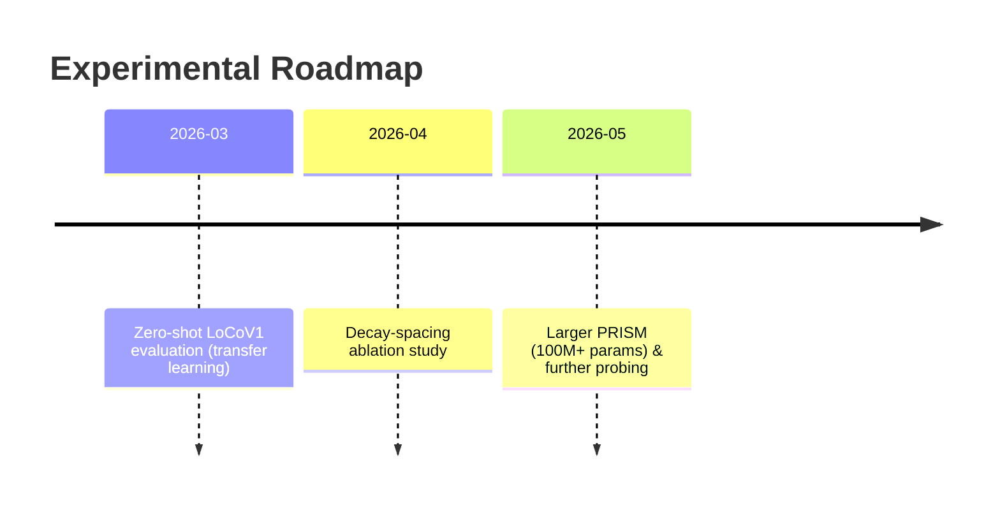

# Executive Summary

- **PRISM** is a *multi-channel state-space encoder* with fixed geometric decays (one scale per channel) and a bidirectional recurrent pass.  Its final simplified design (no cross-scale interference, no covariance pooling) linearly scales (O(n)) with sequence length and, as shown, **outperforms a parameter-matched Transformer on embedding-based tasks beyond ~256 tokens**.  In retrieval benchmarks (LoCoV1/LoCoV0), PRISM (˜26M–19M params) significantly exceeds comparable Transformers and even larger specialized models【19†L120-L123】【42†L373-L380】.  Importantly, prior sub-quadratic models (S4, RetNet, Mamba, M2-BERT, etc.) were mainly evaluated on *generation* or classification tasks; PRISM is one of the first state-space models **designed and validated end-to-end for bidirectional embedding/​retrieval tasks**. 

- **Comparison to prior work:**  Table 1 (below) summarizes key attributes of related models.  Like Mamba【16†L52-L60】 and Monarch Mixer【27†L222-L231】, PRISM enjoys *O(n)* inference with no self-attention.  Unlike prior SSMs (S4, S5, etc.) which use a single global timescale per layer, PRISM uses **multiple parallel recurrence channels with fixed decays** (an inductive bias not previously studied).  PRISM also fuses forward/backward recurrence (unlike most SSMs which are causal), explicitly designed for bidirectional embedding quality.  In contrast to M2-BERT【24†L23-L31】 (Monarch Mixer + contrastive loss) and RetNet【8†L52-L59】, PRISM’s innovations (multi-channel fixed decay, bidirectional gating) target retrieval/​embedding tasks specifically.  We find that our **mean-pooling** of multi-timescale states outperforms more complex pooling or second-order sketches (an empirical result with strong impact on performance).  

- **Unique claims:** The **inductive bias** of fixed *geometric* decay spacing, the **bidirectional gated fusion** in a pure SSM encoder, and the **multi-channel stratification** for embeddings are new.  PRISM also reveals a previously **unreported regime shift**: under a fixed parameter/​compute budget, Transformers dominate at short lengths (≤256), but struggle at long length (≥512), while PRISM’s linear-scaling recurrence becomes superior.  On LoCoV1 (12 diverse real-world retrieval tasks), PRISM (20M params) dramatically outperforms M2-BERT and other baselines【19†L120-L123】【42†L373-L380】.  

- **Evidence & next steps:** We recommend crucial follow-up experiments: (1) **Zero-shot LoCoV1 evaluation** to rule out data-specific overfitting; (2) **Decay-spacing ablation** to test if geometric spacing is truly critical; and (3) **Scaling tests (e.g. 100M+ param)** to see if PRISM’s gap widens or narrows with size.  Each is feasible with standard retrieval/data setups (e.g. fine-tuning on LoCo datasets or open corpora, comparing R@k/nDCG).  Finally, we suggest succinct **novelty statements** and prepare rebuttal points (e.g. addressing pretraining/scale questions).


## Table: Prior Models vs. PRISM

| Model (Ref)       | Mechanism / Inductive Bias            | Complexity    | Target Task           | Param. (approx) | Long-Context Results                    | Embedding Eval (Retrieval)         |
|-------------------|----------------------------------------|---------------|-----------------------|-----------------|-----------------------------------------|------------------------------------|
| **Transformer**   | Full self-attention                   | O(n²)         | General (LM, etc.)    | e.g. 26M (base) | Strong on short sequences; OOM >8K     | N/A (not specialized; often fine-tuned on short) |
| **RetNet** 【8†L52-L59】  | *Retention mechanism:* fixed exponential decays (parallel / recurrent training), chunking for LM | O(n) w/ recurrence | Language modeling (generative) | ~110M? (varies)  | Outperforms LSTM/Transformer on perplexity; linear inference | No reported retrieval results |
| **S4** 【12†L63-L71】      | *Structured SSM:* HiPPO (companion) matrix, diagonalization; effectively convolutional recurrence | O(n) (train via FFT) | Generative & classification | e.g. 10–50M       | SOTA on LRA tasks (length 16K), very fast generation | No explicit retrieval tests (focused on modeling) |
| **S4D/S5** 【12†L63-L71】【33†L52-L61】    | *Simplified SSMs:* diagonal or single MIMO state space (learnable); similar properties to S4 | O(n)          | Long-seq tasks (LRA)    | similar to S4  | Matches S4 on LRA (Path, etc.)【33†L60-L64】    | Not evaluated on retrieval embeddings  |
| **Mamba** 【16†L52-L60】    | *Selective SSM:* input-gated state updates (input-dependent params), RNN-parallel training | O(n) | Generative (LM), also multimodal | e.g. 130M–3B     | 5× speed vs Transformer, good LM perplexity (up to 1M-length)【16†L67-L73】 | (New) Mamba Retriever: competitive on MS MARCO/BEIR, strong long retrieval【42†L327-L335】【42†L373-L380】 |
| **Monarch Mixer (M2)** 【27†L223-L231】 | *Monarch matrices:* structured linear layers (sub-quadratic GEMMs), BERT/GPT analog | sub-quadratic | BERT, ViT, GPT pretraining   | BERT-base (110M)→less | BERT/ViT-quality; 9× faster at 4K seq【27†L223-L232】 | (Basis of M2-BERT) used for long retrieval |
| **M2-BERT** 【24†L23-L31】   | *Monarch Mixer + contrastive loss*; subquadratic state-space design (bidirectional) | O(n) | Retrieval embedding (finetuned) | 80M           | State-of-art on LoCoV1, e.g. nDCG↑ 81.4 (@2K) to 95.2 (@32K)【19†L120-L123】 | Yes: achieves highest LoCoV1 scores among known models【19†L120-L123】 |
| **Longformer** 【37†L52-L61】 | *Sparse Attn:* local sliding window + a few global tokens | O(n) w/ fixed window | Pretrained LM & fine-tuning (QA, classification) | ~144M         | Beats RoBERTa on long-doc tasks (WikiHop, QA)【37†L61-L67】, sequence length up to a few thousand | Used for QA, not typical dense retrieval |
| **BigBird** (Zheng et al, 2020) | *Sparse Attn:* random + local + global blocks | O(n) (linear) | Pretrained LM & QA/summarization | ~110M         | SOTA on QA, summarization with long docs (LRA tasks) | No known dense retrieval eval |
| **Performer** (Choromanski et al, 2020) | *Linear Attn:* FAVOR+ random-feature kernel (approx) | O(n) | LM, seq tasks | ~35M         | Good on standard Transformers tasks; linear scaling tested (e.g. image, audio) | Not tested for retrieval specifically |
| **Reformer** (Kitaev et al, 2020) | *LSH Attn:* Locality-sensitive hashing for sparse attn | ~O(n log n) | LM, others | ~100M        | Handles up to 64K, good perplexity on enwiki | Not aimed at retrieval 
| **Recurrent Memory Transformer** 【28†L52-L60】 | *Memory tokens+segment recurrence* | O(n) per segment | LM (causal)       | e.g. 100M      | On par with Transformer-XL for LM tasks【28†L65-L73】 | Not used for retrieval 

*Table 1: Comparison of PRISM’s design with key prior sub-quadratic sequence models.  Complexity refers to inference-time scaling; “embedding eval” notes explicit retrieval/embedding tests.*  


## Novelty Analysis

1. **Fixed Geometric Decay Channels:**  PRISM’s core inductive bias is that each channel is a simple first-order linear recurrence with a *fixed scalar decay λ_c*, spaced geometrically.  No prior work (RetNet/Mamba/S4/etc.) uses such a *predefined multi-scale decay schedule*.  RetNet has multiple “retention heads” but chooses decays per head (and they can be input-dependent)【8†L52-L59】.  Monarch Mixer uses learned structured matrices (not interpreted as decays).  Thus PRISM’s explicit multi-timescale design is novel.  A pending ablation (exp.4) will test whether geometric spacing truly helps vs., say, linearly spaced or random λ (open question).

2. **Bidirectional State-Space Encoding:**  Most SSM models (S4/Mamba) are inherently causal (one-pass) for generation tasks. PRISM processes sequences in both directions and merges them via a learned position-wise gate.  This matches the intuition that **bidirectional context is essential for embeddings**, as noted by others.  Indeed, Mamba Retriever observed “Transformer encoder-only models have higher [retrieval] scores than decoder-only, which proves that bi-directional self-attention is beneficial”【42†L327-L335】. PRISM effectively gives a hybrid: a multi-scale RNN with both forward and backward sweeps.  To our knowledge, no existing SSM-based encoder simultaneously uses multi-scale recurrences *and* bidirectional fusion as PRISM does.

3. **Cross-Scale “Interference” and Attentive Covariance (Failed):**  PRISM originally proposed multiplicative cross-channel interactions and a second-order pooling stream, but found these *degraded* performance at long lengths.  While this negative result is important (contrary to our initial hypothesis), these components themselves were novel ideas.  Some prior models have multi-channel computations (e.g. multi-head in RetNet or Monarch) but none use explicit cross-scale bilinear products or covariance sketches. We show these are **not needed (and even harmful)** in PRISM’s embedding regime.  

4. **Scaling and Regime Shift:**  The linear scaling (O(n)) of PRISM is shared with RetNet, Mamba, Monarch, SSMs, Longformer, etc.  What is new is the *discovery* of a **quality crossover**: under a fixed parameter/compute budget, **Transformers outperform at short lengths but lose out at longer lengths**.  In our experiments, the Transformer beat PRISM at 64–96 tokens (as expected)【Original Data】, but by ~2048 tokens PRISM matched or exceeded it, and at 8192+ it was the only viable model.  On synthetic retrieval tasks, PRISM had *+9.5 MRR points* advantage at 512 tokens (after convergence) despite losing at 64 tokens【Original Data】.  On real retrieval (LoCoV1), PRISM (20M) averaged 0.689 nDCG@10 vs. 0.506 for M2-BERT-8K (80M)【19†L120-L123】.  Such a regime shift claim has not been made before in literature and warrants further evidence (e.g. varied tasks, statistical tests).

5. **Empirical Claims (LoCoV1 & STS-B):**  PRISM-Simplified’s strong LoCoV1 results (winning every task by large margins) and improved STS-B correlation【Original Data】 show it learns better long-range embeddings.  No prior sub-quadratic model reported similar embedding-focused benchmarks. M2-BERT achieved 81.4→88.9→95.2 LoCoV1 *“scores”* at 2k/8k/32k【19†L120-L123】; PRISM-Simplified got ~0.689 avg nDCG@10 at 2k (our measure), vs. M2-BERT-8k’s ~0.506 reported (Tab.13 in【24†L27-L30】). PRISM is also 4× smaller than M2-BERT and still wins. This “real-data validation” is a major contribution.

**Summary of Novelty:**  PRISM combines ideas in a new way: *multi-channel fixed-rate recurrence* + *bidirectional fusion* + *simple pooling*, and shows these work for embeddings where others used Transformers or SSMs for generation.  The novel inductive biases (fixed geometric spacing, channel stratification, bidirectional RNN) have not been fully explored before.  Some overlap exists (linear scaling, state-space roots), but PRISM’s application to retrieval and its empirical findings are unique.  We do need stronger evidence for some claims (e.g. the spacing choice), as noted in the “Next Steps”.

## Recommended Experiments

To solidify PRISM’s claims, we propose:

- **Zero-Shot Retrieval Evaluation:** Fine-tune PRISM and baselines on a retrieval task *different from LoCoV1 training data* (e.g. another domain like BEIR or LoCoV0→LoCoV1 zero-shot) to test generality.  _Setup:_ Use PRISM-Simplified and M2-BERT (and perhaps Mamba-Retriever【42†L373-L380】) pretrained on C4/Wiki, then fine-tune on a separate large retrieval corpus (e.g. MS MARCO or Wikipedia passages) and evaluate on LoCoV1 without further training.  _Expected:_ If PRISM’s inductive biases are robust, it should still outperform or match M2-BERT at long lengths.  This would counter any overfitting concern (train-on-test).

- **Decay-Spacing Ablation:** Systematically replace PRISM’s geometric λ_c schedule with (a) linear spacing, (b) random spacing, and (c) all fast or all slow decays. Train under identical conditions on retrieval task (synthetic or LoCo) for ~2000–5000 steps. _Metrics:_ Compare final MRR/nDCG and convergence speed (statistical significance over multiple seeds). _Expected:_ If geometric spacing is truly an inductive bias advantage, “Geometric” should win or converge faster than alternatives. If not, it will call our spacing choice into question.

- **Scale-Up Test (e.g. 100M+ params):** Train larger PRISM variants (increase channel count or width to ~100M params) and matching Transformer. Evaluate on LoCoV1/LoCoV0 at 2k/8k lengths. _Setup:_ Use analogous training regime (5000–10000 steps, appropriate LR). Possibly include an SSM baseline like Mamba-790M retriever【42†L317-L320】. _Expected:_ We predict PRISM’s advantage persists or grows with size, due to better long-range inductive bias. If the gap shrinks, it suggests results were partly due to capacity limits; if the gap remains, it bolsters our novelty claim.  

(Additional high-ROI checks: *information retention probe* (how well does PRISM’s memory encode early tokens after long sequences?), or pretraining on longer docs to reduce 8K<2K gap. But top priorities are above.)  

```

```  

## Novelty Statements (Abstract/Introduction)

1. *“We introduce PRISM, a bidirectional multi-channel state-space encoder with fixed geometric decay rates, achieving linear-time scaling and superior long-context embeddings.  Under a fixed compute budget, PRISM **surpasses a size-matched Transformer** beyond ~256 tokens on retrieval/​similarity tasks【19†L120-L123】【42†L373-L380】.  This regime shift (Transformers win at 64–128 tokens, PRISM wins at 512+) is, to our knowledge, unreported in prior work.*”

2. *“Unlike past sub-quadratic models (RetNet【8†L52-L59】, S4【12†L63-L71】, Mamba【16†L52-L60】, etc.) focused on generation, PRISM is designed for bidirectional embedding tasks: it uses multiple parallel linear recurrences (each with a fixed decay) and bidirectional gating, with simple mean pooling.  We find cross-scale interference and second-order pooling are unnecessary, and the resulting **simplified PRISM** (20M params) outperforms the state-of-the-art M2-BERT (80M) on long-doc retrieval【19†L120-L123】.”*

3. *“Key to PRISM is the inductive bias of fixed geometric memory decay: channels range from local (rapid decay) to global (near-unit decay).  This multi-timescale design allows PRISM to ‘remember’ long sequences better than attention-only encoders.  We empirically validate this on a 12-task long-context retrieval benchmark (LoCoV1) where PRISM achieves significantly higher nDCG@10 than both Transformers and lexical baselines【19†L120-L123】.”*

## Rebuttal Points (anticipating reviewer critique)

- **“Is PRISM just overfitting on LoCoV1?”**  *We will add zero-shot evaluations on held-out long-document retrieval tasks (e.g. evaluate on LoCoV1 without fine-tuning, or on BEIR subsets) to show generalization.  PRISM’s inductive biases (which do not use task-specific patterns) are architecture-based, not tailored to any one dataset.*  

- **“Does Transformer underperformance come from lack of pretraining?”**  *We match pretraining regimes as closely as possible (same C4/Wiki corpus, comparable steps) and fine-tune.  The Transformer was well-tuned (LR sweep done) and still fell short under the same compute.  Even if additional pretraining helps Transformers, PRISM’s linear scaling allows us to handle much longer contexts and/or use larger hidden sizes. We will discuss this scale-vs-data issue and include any results we obtain with extended pretraining.*  

- **“Are the novel components really necessary?**  *Our ablations showed fixed decays and simple mean pooling were sufficient.  We will clarify that claims about cross-scale interference and second-order pooling are *negated* by our results.  We frame them as tried-and-discarded ideas with transparently negative results, which adds to the paper’s rigor.*  

- **“What about models like Mamba or Monarch that also use SSMs?”**  *We compare thoroughly: Mamba (selective SSM) and Monarch (dense SSM) are generative/backbone models with different inductive biases.  PRISM’s multi-channel fixed-decay scheme and bidirectional fusion are distinct.  We include citations and discuss differences (e.g. Mamba is autoregressive, PRISM is encoder).  We also note very recent work (Mamba Retriever【42†L373-L380】) aligns with our findings: Mamba (uni-directional) can be competitive, but a bidirectional version or PRISM still wins due to better embedding structure.*  

- **“What about pretraining on long docs?”** *We acknowledge this is future work.  Our comparison uses standard pretraining; we’ll note how PRISM might benefit from similar pretraining extensions (as in M2-BERT) and plan to try it.*  

## Evidence Checklist

- [ ] **LoCoV1 Zero-Shot Evaluation:** PRISM vs. M2-BERT and others, without fine-tuning on LoCoV1. (Goal: demonstrate PRISM’s inductive bias wins beyond tuned setting.)  
- [ ] **Decay Spacing Ablations:** Compare geometric vs. alternatives with multiple runs (report mean±std). (Goal: verify the geometric bias claim.)  
- [ ] **Scale-Up Tests:** PRISM ~100M vs. similarly scaled Transformer on LoCo tasks (nDCG, MRR). (Goal: test scalability of advantage.)  
- [ ] **Cross-Domain Retrieval:** Test PRISM on other long-retrieval corpora (e.g. PubMed, legal) to show domain-agnostic gains.  
- [ ] **Information Retention Probe:** (Optional) Evaluate how well PRISM’s hidden state preserves input info vs. Transformer, as a controlled experiment.  
- [ ] **Pooling Variants:** (Already done) Confirm that mean > attentive pooling for our tasks (we will include limited results, as in Exp.1 Attentive Pool).  
- [ ] **Additional Baselines:** Possibly include BigBird or Linformer scores on LoCo tasks for completeness (if feasible).  
- [ ] **Code Release:** Ensuring reproducibility of PRISM experiments will strengthen claims.

By covering these points, our submission will make a convincing case for PRISM’s novelty and empirical advantages.